# 数据挖掘 个贷违约预测实验报告

## 数据分析与预处理

### 数据预处理框架

​		将特征类型分成三类（数值型，类别型，和其他类型）在pre_process.py中定义了Dataset类型，其中的preprocess会对输入的Dataframe进行处理，转化成训练特征/标签，验证特征/标签，训练特征/（标签），分别进行encode。

#### 数值型

​		对于缺失值使用该特征的平均值进行填充（data cleaning），然后进行z-score归一化（减去均值，除以标准差，数据标准化）

```python
numeric_transformer = Pipeline(
    steps=[
        ("imputer", SimpleImputer(strategy="mean")),
        ("scaler", StandardScaler()),
    ]
)
```

#### 类别型

​		首先对于缺失值使用该特征中出现最为频繁的类别进行填充（data cleaning），然后比较使用了两种encoder（数据标准化）。一种是把出现的类别依次编成0、1、2...的OrdinalEncoder，另一种是将每个类别生成一个0/1的新特征的OneHotEncoder，实践效果上OrdinalEncoder的效果较好一些。

（encoder对fit时未出现但transform时出现的类型，分别采用了以-1编码和忽略该类别全写0的处理方式）

```python
categorical_transformer = Pipeline(
    steps=[
        ("imputer", SimpleImputer(strategy="most_frequent")),
        (
            "ordinal",
            OrdinalEncoder(
            	handle_unknown="use_encoded_value", unknown_value=-1
            ),
        ),
        # ("onehot", OneHotEncoder(handle_unknown="ignore")),
    ]
)
```

#### 其他类型

​		主要是对于时间类型的处理，自定义了一些encoder位于encoder.py。

​		首先是work year，主要是从文本字符串中提取时间，见WorkYearEncoder。对于issue_date则是尝试了两种方法，一种是将其拆分成年和月两个特征，一种是将其转化成年份*12+月份的方式处理，结果显示后者的效果会比较好，因为前者生成的两个列之间没有关联而后者则能体现时间的先后关系，见IssueDateEncoder。

​		另外还尝试了对特征进行合并创建新特征的方法，我们尝试按照数值型特征进行Kmeans聚类，将聚类结果作为一个新的特征来提升分类效果，见KmeansEncoder。

### 数据特征影响分析

​		在这一部分中主要对不同的特征在isDefault为0/1时的分布进行了比较，在两类中该特征的分布越不一致，则该特征应该越重要，具体的分布图见data/visualization（数据可视化，观察不同特征的重要性）。后续将不重要的特征删去后，比较了roc-auc的变化。

​		从结果上看，在isDefault=0/1两边分布几乎一致的几个特征是：app_type，del_in_18month，employer_type，f1，industry，initial_list_status，issue_date，known_dero，post_code，region，title，use，work_year；其余特征在两边的分布差异相对显著一些。

​		下面挑选了部分上述不显著特征的分布图作为示例，完整的可以参见data/visualization：

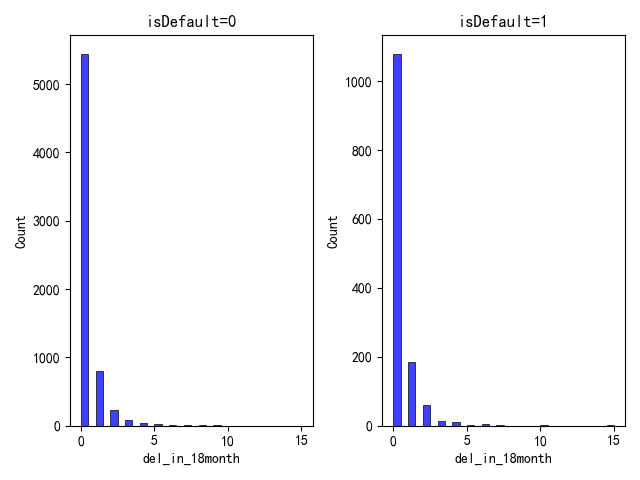 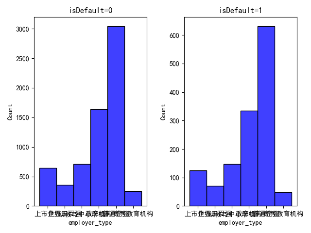 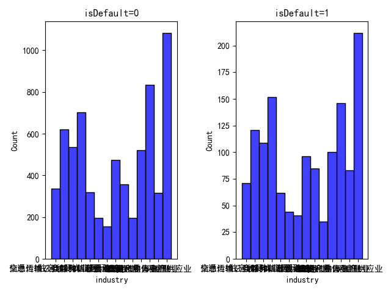

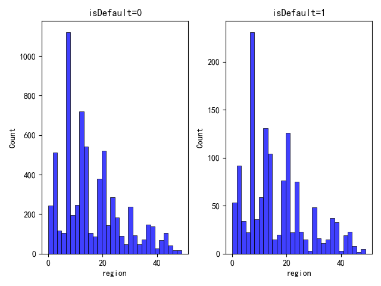 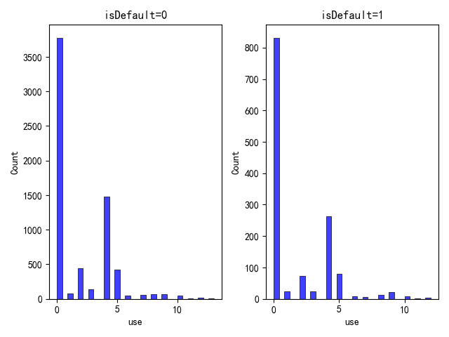 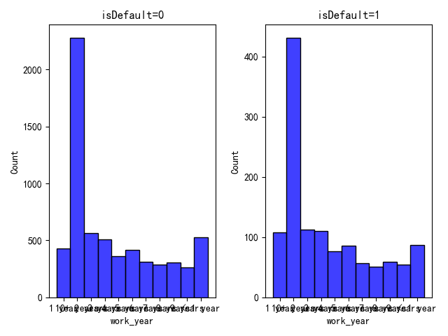

​				下面挑选了部分显著特征的分布图作为示例：

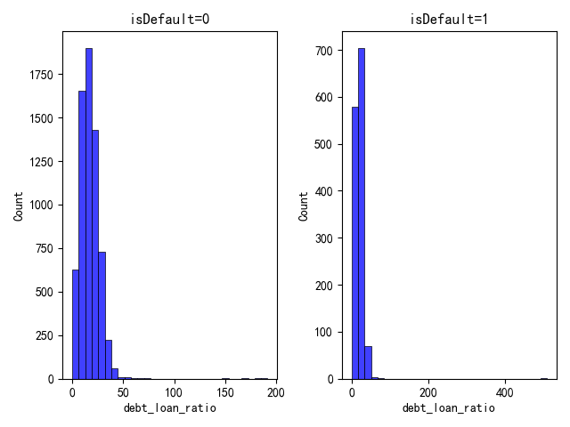 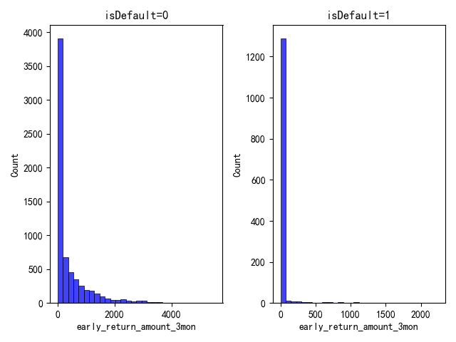 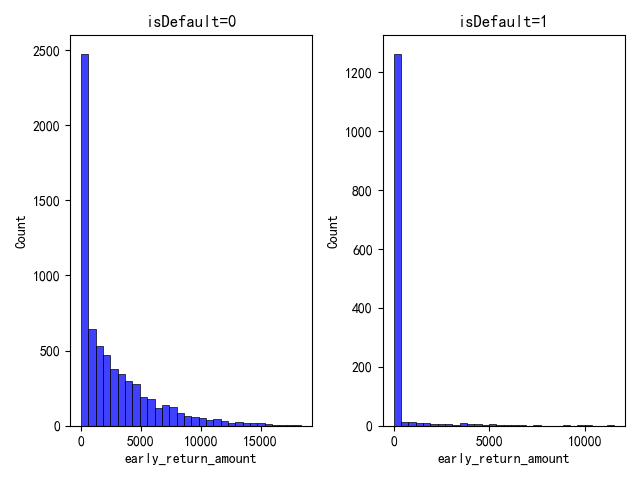

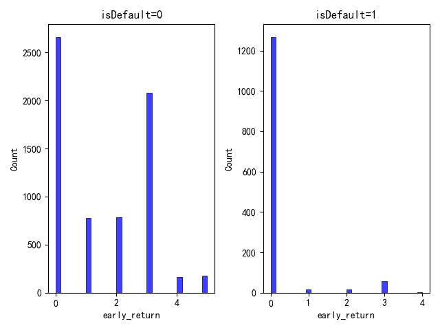 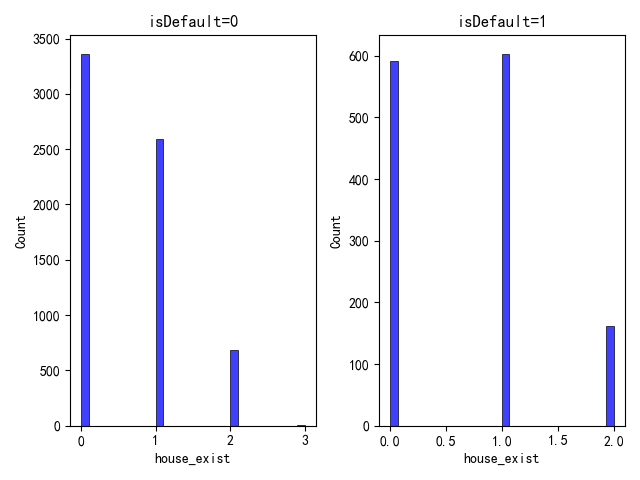  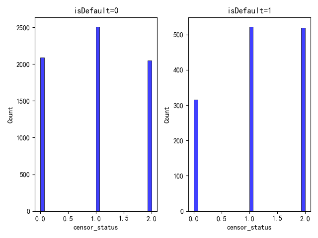

​		接下来尝试使用逻辑回归的分类算法，逐个移除上述图中6个不显著特征和6个显著特征，比较在验证集上的效果变化：

baseline，逻辑回归使用全部特征0.8623443352317289

| 移除不显著特征  |      roc-auc       |       移除显著特征       |      roc-auc       |
| :-------------: | :----------------: | :----------------------: | :----------------: |
| del_in_18months | 0.8621024547207013 |     debt_loan_ratio      | 0.8607537876289111 |
|  employer_type  | 0.8627419721324332 | early_return_amount_3mon | 0.8619192119093169 |
|    industry     | 0.8622508813979226 |   early_return_amount    | 0.8493780738981611 |
|     region      | 0.8626998262858149 |       early_return       | 0.8537392528091123 |
|       use       | 0.8622802002477443 |       house_exist        | 0.8594747528054475 |
|    work_year    | 0.8625349077555686 |      censor_status       | 0.861574715423914  |

​		可以看到移除不显著特征，在验证集上的效果变化非常之小，甚至可能会略微增大，整体变化不超过0.0004；而移除显著特征则在验证集上全部出现了下滑，并且下滑幅度要明显大于不显著特征，最小也有约0.0004，最大则有0.0130。由此看来之前基于isDefault=0/1将特征分布进行可视化来确定特征的重要性的方法是相对合理的。

### 数据预处理尝试

​		和其他组的同学交流了internet数据集的使用方法，但最后从实验效果上并没有采用。

​		我们首先尝试了使用internet集合的全部内容加入public集合来训练模型，但这样的效果并不好，以随机森林分类算法为例，使用全部的internet训练会使得在验证集上的roc-auc从0.876762795845519下降到0.8656656111880731，分类效果恶化。我们认为原因是internet训练集中样本的数量显著多余public训练集，因此如果不加筛选地全部引入internet训练集几乎等效于在internet训练集上训练，而internet训练集中特征的分布，相比public训练集，应该和test的特征分布相差更远，从而导致了训练效果的恶化。

​		然后在与其他组讨论后，尝试了如下方法：先在public训练集上训练出一个模型，然后使用该模型对internet数据集进行预测，将其中估计得到的概率与实际标签相差绝对值最小的若干条加入挑选出来，加入训练集重新训练模型。使用这个方法的原理是从internet训练集中挑选出和public训练集最接近的若干样本，最接近我们就是通过预测结果和实际标签差的绝对值大小来比较，相差越小则说明这条internet中的样本月接近于public中的样本，从而将其引入训练集，增大训练集的大小，提升训练效果。但从实际的效果来看，在验证集上roc-auc相比只使用public训练集的模型出现了一定的下降，以随机森林分类方法为例，roc-auc下降为了0.8764989261971253，虽然比直接全部引入internet训练的效果好，但其实比不引入时要低，在测试集上也并没有显著提升，因此最后放弃了。具体的代码是先运行internet_select.py，然后在main.py运行的时候指定命令行参数引入上一步选出的internet子集，更详细的使用方法减README.md。

## 算法实现与分析

### 算法框架

​		尝试了多种分类算法，包括逻辑回归，随机森林，xgboost，神经网络，lightgbm（Light Gradient Boosting Machine）。首先在model.py中定义了关于分类模型的基本方法，包括初始化，训练，预测，验证。并在具体的每个模型中完善了每个模型自身的训练与验证部分。

​		在主函数main.py中可以根据命令行参数选择使用哪个分类算法，以及是否在训练集中包含internet，具体见README.md。

### 不同算法分析

​		同样只在train_public.csv上训练，不使用internet数据，使用默认模型参数，得到以上方法在验证集上的训练效果如下：

|         算法          |     验证集结果     |
| :-------------------: | :----------------: |
|  Logistic Regression  | 0.8623443352317289 |
|     Random Forest     | 0.876762795845519  |
|        XGBoost        | 0.8657215002455455 |
| Neural Network（MLP） | 0.8628537502473779 |
|       lightgbm        | 0.8820209483181976 |

​		比较而言，随机森林和lightgbm的分类效果比较好，逻辑回归、神经网络则明显差一些。因此我们最后选取了lightgbm方法并添加了网格参数搜索，最后将lightgbm在验证集上的分类效果提升到了0.8898270920831775，在测试集上的效果为0.88338。有关超参搜索的代码如下：

```python
param_grid = {
    "learning_rate": [0.01, 0.05, 0.1],
    "min_child_samples": [30, 50, 70],
    "subsample": [0.8, 0.9, 1.0],
    "colsample_bytree": [0.8, 0.9, 1.0],
}

grid_search = GridSearchCV(
    estimator=self.model,
    param_grid=param_grid,
    scoring="roc_auc",
    cv=5,
    verbose=0,
    n_jobs=8,
)

grid_search.fit(self.train_feature, self.train_label)

self.model = grid_search.best_estimator_

print("Best parameters found: ", grid_search.best_params_)
print("Best AUC score: ", grid_search.best_score_)

self.model.fit(
    self.train_feature,
    self.train_label,
    eval_metric="auc",
    eval_set=[(self.validation_feature, self.validation_label)],
)
```

​		从结果上看，效果较好的随机森林、lightgbm都是使用了集成学习的方法，训练多个分类器然后进行投票决定最后的分类结果。在集群学习中，整体分类错误需要集群中至少一半的分类器同时分类出错，相比单个分类器分类出错，集群学习的出错概率大大降低，因此最后的分类效果比较好。另外，神经网络的分类效果比预想的差很多，个人认为是因为采用的MLP结构中只涉及线性运算和sigmoid激活函数，模型的结构实际上还是比较简单，但相对更复杂的CNN，RNN等结构个人认为在原理上不适合个贷违约预测的任务，因为特征之间没有关联性，样本之间也没有关联性，独立性很强，而CNN、RNN等结构都是利用数据空间、时间上相关性处理的，因此最终没有采用这些更复杂的算法。

### 手动实现算法

​		选择了logistic regression进行手动实现，逻辑回归的原理是使用梯度下降的方法寻找一组最合适的参数$\theta$，使得损失函数（预测结果和实际标签的差异）：${1\over2}{\Sigma_i(predict_i-label_i)^2}$最小化。使用梯度下降法求解最佳参数$\theta$，设$predict_i=h_\theta(\vec {sample_i})$，则${\part cost\over \part \theta_j}=\Sigma_i[(h_\theta(sample_i)-label_i)\times{\part h_\theta(sample_i)\over \part\theta_j}]$，在线性回归中$h_\theta(sample_i)=\Sigma_jsample_i\_feature_j \times \theta_j$，因此${\part h_\theta(sample_i)\over \part\theta_j}=sample_i\_feature_j$。在逻辑回归中虽然$h_\theta(\vec {sample_i})=\Sigma_j(sigmoid(z_{ij}))$，$z_{ij}=sample_i\_feature_j\times \theta_j$，但在更新$\theta$的时候还是取用${\part h_\theta(sample_i)\over \part\theta_j}=sample_i\_feature_j$。

​		因此最终对$\vec\theta$的更新量为$\alpha\times\Sigma_i[(label_i-predict_i)\times sample_i]$，对于偏置bias，$sample_i\_feature_j$直接取1，而$predict$的算法则为$predict_i=\Sigma_j(sigmoid(z_{ij}))$，$z_{ij}=sample_i\_feature_j\times \theta_j$。最终代码表示如下：

```python
for _ in tqdm.tqdm(range(self.max_iter)):
	predcit = sigmoid(np.dot(self.train_feature, self.weights) + self.bias)

    self.weights += self.learning_rate * (
        (1 / self.train_num)
        * np.dot(np.transpose(self.train_feature), (self.train_label - predcit))
    )

    self.bias += self.learning_rate * (
        (1 / self.train_num) * np.sum(self.train_label - predcit)
    )

    if cost(predcit, self.train_label) < self.tol:
        print("logistic regression converges")
        break
```

​		最后在验证集上的实验效果为roc-auc=0.8327194699151952，迭代轮数1000000，学习率0.0001，但最后没能把cost收敛到tol=0.0001。相比直接调包的做法，手动实现的逻辑回归最明显的是性能下降，迭代的次数要远多于sklearn中的实现，最终也没有收敛，效果还有待提升。sklearn的逻辑回归中增加有正则化、多种损失最小化方法、自动确定学习率等先进措施，因此性能比较高，最终的roc-auc也比较好。

## 分工情况

|  姓名  |                             分工                             |
| :----: | :----------------------------------------------------------: |
| 尤梓锐 | 数据预处理框架，模型算法框架，random forest、xgboost调用，logistics regression手动实现，neural network半手动实现，internet数据集处理及使用，其他类型特征自定义pipeline。数据预处理、分类模型的分析比较，实验报告撰写以及README.md撰写。 |
| 黄俊尧 |                    lightgbm调用，超参搜索                    |
| 张真赫 |      logistic regression调用，数值型/类别型特征pipeline      |

